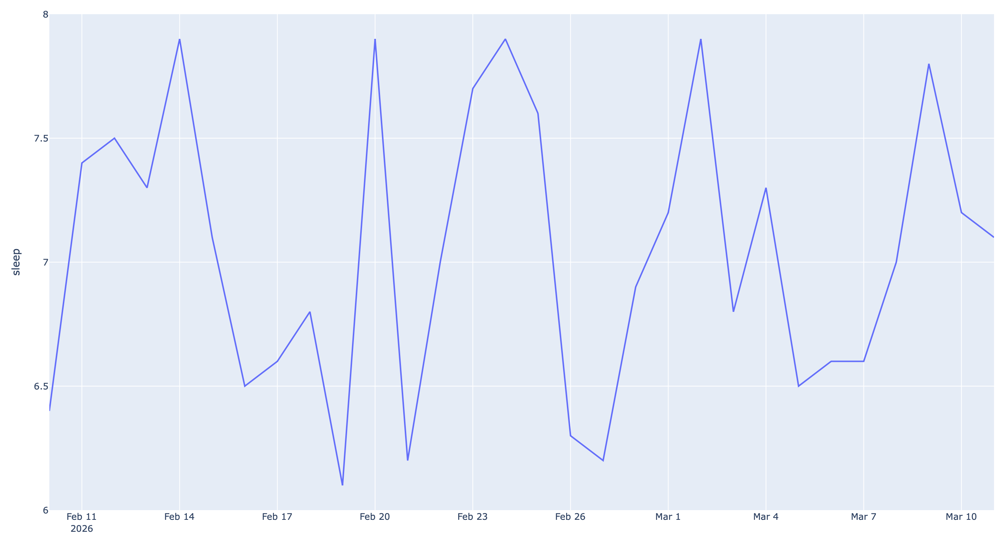

# LifeGraph

> Quantify your life like a developer.

**LifeGraph** automatically collects your personal data (Garmin, GitHub activity, mood, deep work, sleep) and turns it into **insights and visualizations**.

Self-hosted. Private. Hackable.

---

## ✨ Features

* 📊 **Automatic life analytics**
* ⌚ **Garmin sync** (steps, sleep, heart rate)
* 🧑‍💻 **GitHub activity tracking**
* 🤖 **AI life insights**
* 📈 **Beautiful charts (no Grafana required)**
* 💬 **Telegram bot logging**
* 🔒 **Self-hosted & private**

---

## 📸 Example Insights

LifeGraph automatically generates insights such as:

* **Sleep vs Coding Productivity**
* **Steps vs Mood**
* **GitHub Commits vs Sleep**
* **Deep Work vs Mood**

Example visualizations:

* Sleep trend
* Step trend
* Sleep vs Mood correlation
* GitHub coding heatmap

---

## 🧠 Why LifeGraph?

Many people track their life with multiple apps:

* fitness apps
* productivity tools
* coding trackers

But the data is **fragmented**.

LifeGraph connects everything and lets you analyze your life like a dataset.

Example questions you can answer:

* Do I code better after sleeping 8 hours?
* Does exercise improve my mood?
* Does walking more increase productivity?

---

## 🏗 Architecture

```
                 Telegram Bot
                       │
                       ▼
                FastAPI Backend
                       │
       ┌───────────────┼───────────────┐
       ▼               ▼               ▼
  Garmin Sync      GitHub Sync      Manual Logs
       │               │               │
       └───────────────┴───────────────┘
                       ▼
                  SQLite DB
                       ▼
               Visualization Engine
                       ▼
                  Web Dashboard
```

---

# 🚀 Quick Start

Follow these steps to run LifeGraph locally and generate your first life analytics charts.

---

## 1 Clone repository

```bash
git clone https://github.com/Evermaple/LifeGraph.git
cd lifegraph
```

---

## 2 Install dependencies

```bash
pip install -r requirements.txt
```

---

## 3 Initialize database

Create the SQLite database:

```bash
python -m app.db
```

This will create:

```
data/life.db
```

---

## 4 Generate demo data

To quickly test the analytics pipeline, generate sample life data:

```bash
python scripts/generate_demo_data.py
```

This will generate about **30 days of example metrics**.

Example data:

| date       | sleep | steps | mood | deepwork |
| ---------- | ----- | ----- | ---- | -------- |
| 2026-03-01 | 7.5   | 8200  | 4    | 3        |
| 2026-03-02 | 6.8   | 6000  | 3    | 2        |
| 2026-03-03 | 8.0   | 10000 | 5    | 4        |

---

## 5 Generate analytics charts

Run:

```bash
python -m analytics.charts
```

This will generate charts:

```
charts_sleep.html
charts_steps.html
sleep_mood.html
```

Open them in your browser.

---

# 📊 What you will see

LifeGraph will generate charts such as:

* Sleep trend over time
* Daily step trends
* Sleep vs Mood correlation
* Productivity insights

Example output:

```
charts_sleep.html
```

---

## 🔗 Data Sources

LifeGraph currently supports:

| Source       | Data                     |
| ------------ | ------------------------ |
| Garmin       | steps, sleep, heart rate |
| GitHub       | commits, coding activity |
| Manual logs  | mood, deep work          |
| Telegram bot | daily quick logging      |

More integrations coming soon.

---

## 📊 Example Charts

LifeGraph automatically generates:

* Sleep trend
* Steps trend
* Sleep vs Mood
* Coding activity

Charts are exported as **interactive HTML dashboards**.

---

## 🤖 AI Insights (Optional)

LifeGraph can generate weekly insights using AI models.

Examples:

* *You code 28% more after sleeping more than 7 hours.*
* *Days with >8000 steps correlate with better mood.*

Supported providers:

* OpenAI
* Anthropic

---

## 🔒 Privacy

Your data stays **local**.

LifeGraph is fully **self-hosted**:

* no cloud storage
* no analytics tracking
* no third-party dashboards

---

## 🛠 Roadmap

Upcoming features:

* Apple Health sync
* VSCode coding time
* GitHub style life heatmap
* AI life coach
* mobile dashboard
* multi-device support

---

## 🤝 Contributing

Contributions are welcome!

Ideas for contributions:

* new data sources
* better visualizations
* integrations
* AI insights

---

## ⭐ If you like this project

Give it a star on GitHub ⭐

---

## 📜 License

MIT License

